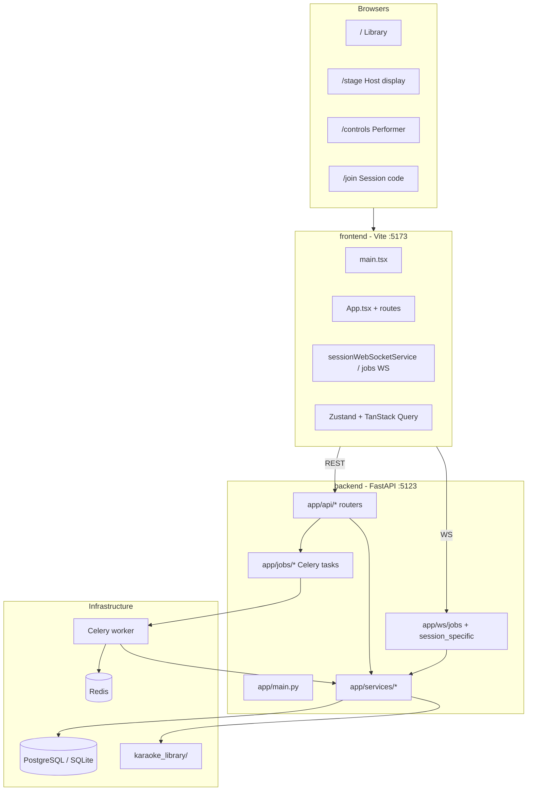

# Open Karaoke Studio — codebase guide

Self-hosted karaoke for small groups: download from YouTube, separate vocals with AI (Celery + Demucs/Roformer), sync lyrics and playback across phones/TV via WebSockets. Monorepo: **React frontend** + **FastAPI backend** + **PostgreSQL/SQLite** + **Redis/Celery**.

---

## How the pieces fit together



---

## Main entry points

| Role | Path | What it does |
|------|------|----------------|
| **Frontend bootstrap** | `frontend/src/main.tsx` | React root, TanStack Query provider |
| **Frontend routing & shell** | `frontend/src/App.tsx` | Routes, `SessionProvider`, global job sync (`useJobsSync`) |
| **Backend app** | `backend/app/main.py` | FastAPI app, CORS, routers, **two** WebSocket routes |
| **Celery** | `backend/app/jobs/celery_app.py` + `backend/app/jobs/audio_tasks.py` (via `jobs.py` re-exports) | YouTube download, separation, enrichment |
| **Dev orchestration** | `./setup.sh`, `./scripts/dev-tmux.sh` | One-time setup; API + Vite + Celery in tmux |
| **API docs (runtime)** | `http://localhost:5123/docs` | OpenAPI from FastAPI |

WebSocket registration in the backend (design constraint: **only these two**):

```143:156:backend/app/main.py
# WebSocket Routes - Clean session architecture with only two endpoints
@app.websocket("/ws/jobs")
async def jobs_ws(websocket: WebSocket):
    """WebSocket endpoint for real-time job updates."""
    await websocket_jobs_endpoint(websocket, manager)


@app.websocket("/ws/session/{session_id}")
async def unified_session_ws(websocket: WebSocket, session_id: str):
    """
    Unified session WebSocket endpoint.
    Handles all session-related communication: performance controls, player state, and queue management.
    """
    await websocket_unified_session_endpoint(websocket, session_id, manager)
```

Frontend routes (session vs host vs admin):

```36:100:frontend/src/App.tsx
          <Routes>
            {/* Session entry point - public routes */}
            <Route path="/join" element={<JoinSessionPage />} />
            <Route path="/join/:code" element={<QRJoinPage />} />
            ...
            <Route path="/stage" ... />
            <Route path="/controls" ... />
            <Route path="/host" ... />
            <Route path="/admin" ... />
```

---

## Key modules (where to look for what)

### Backend (`backend/app/`)

| Area | Location | Typical change |
|------|----------|----------------|
| **REST API** | `api/` — `songs.py`, `sessions.py`, `karaoke_queue.py`, `jobs.py`, `youtube*.py`, `lyrics.py` | New endpoints, validation |
| **Real-time** | `ws/session_specific.py`, `ws/jobs.py`, `ws/connection_manager.py` | Queue sync, playback, volume |
| **Business logic** | `services/` — `youtube_service.py`, `audio.py`, `lyrics_service.py` | Processing, lyrics fetch |
| **AI separation** | `services/separation_engines/` (e.g. `three_track.py`, `demucs_standard.py`) | Engine behavior |
| **Data** | `db/models/`, `repositories/`, `schemas/` | Schema, queries |
| **Background work** | `jobs/audio_tasks.py`, `jobs/enrichment_tasks.py`, … | Celery pipelines |
| **Config** | `app/config/` | Env, CORS, paths |

Song files land under `karaoke_library/{song_id}/` (`original.mp3`, `vocals.mp3`, `instrumental.mp3`, optional `backing_vocals.mp3`).

### Frontend (`frontend/src/`)

| Area | Location | Typical change |
|------|----------|----------------|
| **Pages** | `pages/` — `Library.tsx`, `Stage.tsx`, `PerformanceControlsPage.tsx`, `AddSong.tsx` | Screen-level UX |
| **Session lifecycle** | `contexts/SessionContext.tsx`, `stores/sessionStore.ts`, `components/SessionGuard.tsx` | Join/recover/host |
| **Player** | `features/player/` — `KaraokePlayer.tsx`, hooks, `stores/useKaraokePlayerStore.ts` | Playback, audio mix |
| **Lyrics** | `features/lyrics/`, `utils/lrcParser.ts` | Display, timing, count-in |
| **Library & songs** | `features/library/`, `features/songs/` | Browse, add song, admin tools |
| **API layer** | `hooks/api/useApi.ts`, `useSongs.ts`, … + `services/api.ts` | Server state |
| **WebSockets (client)** | `services/sessionWebSocketService.ts`, `services/jobsWebSocketService.ts` | Live sync |

---

## User flows (mental model)

1. **Library / add song** — REST creates `Song` + `Job` → Celery `process_youtube_job` → progress on `/ws/jobs`.
2. **Session** — Host creates session; performers join `/join` or QR; state keyed by `session_id` on `/ws/session/{id}`.
3. **Queue** — Mutations via REST; authoritative updates broadcast on session WebSocket (`queue_updated`, etc.).
4. **Performance** — Stage shows `KaraokePlayer`; phones use `/controls` for volume, lyrics size, seek — all mirrored via session WS + Zustand.

`docs/architecture.md` walks through pipeline phases, DB schema, API design, and state flow examples (worth skimming for any WS or queue work).

---

## Read before you change things

**Start here (in order):**

1. **[README.md](README.md)** — product scope and stack.
2. **[CLAUDE.md](CLAUDE.md)** — dev commands, conventions, gotchas (venv, Celery no hot-reload, no global session state).
3. **[docs/architecture.md](docs/architecture.md)** — especially WebSocket architecture, processing pipeline, file layout.
4. **[docs/features.md](docs/features.md)** — feature inventory if you’re touching UX.
5. **[docs/tech-debt.md](docs/tech-debt.md)** — known landmines (e.g. job cancel not wired, `print()` in WS code, sparse frontend tests).

**By task type:**

| If you're working on… | Read first |
|------------------------|------------|
| WebSockets / multi-device sync | `docs/websocket-protocol.md`, `docs/architecture.md` (WebSocket + Session sections), `backend/app/ws/session_specific.py`, `frontend/src/services/sessionWebSocketService.ts` |
| Audio / YouTube / jobs | `backend/app/jobs/audio_tasks.py`, `services/separation_engines/`, `docs/architecture.md` (Processing Pipeline) |
| DB / migrations | `backend/app/db/models/`, Alembic under `backend/alembic/` |
| Player / lyrics | `features/player/`, `features/lyrics/`, `useKaraokePlayerStore` |
| Auth / admin | `api/users.py`, `stores/authStore.ts`, `AdminGuard` / `HostGuard` |

**Non-negotiables from project docs:**

- Session state must be keyed by **`session_id`** — no global dicts for queue/playback/controls.
- Backend: **`logging`**, not `print()` (especially Celery).
- Frontend: **`createLogger()`** from `@/lib/logger`, not `console.log`.
- After **Celery task code** changes: worker must be restarted manually (does not hot-reload).
- Backend Python: activate `backend/venv` before `pytest`, Alembic, etc.

**Checks before PR:**

```bash
cd frontend && pnpm run type-check   # preferred first signal
cd frontend && pnpm run check      # format + lint + types
cd backend && source venv/bin/activate && pytest
```

Root `package.json` also has `lint:backend` / `check:backend` (black, isort, flake8). Branch from **`develop`** per README.

---

## Quick reference: ports & docs

- Frontend: `http://localhost:5173`
- API: `http://localhost:5123` (Swagger at `/docs`)
- Contributing context: `CLAUDE.md`, `docs/roadmap.md`, `docs/tech-debt.md`

If you tell me what you plan to change (e.g. queue, separation engine, lyrics), I can narrow this to a short file-by-file reading list for that area.


Here are **larger** directions worth considering, ordered by impact vs. effort for a self-hosted party app (5–10 users). Several overlap with [docs/roadmap.md](docs/roadmap.md) and [docs/tech-debt.md](docs/tech-debt.md); some of that doc is **stale** (e.g. Celery cancel and WS `print()` appear fixed; frontend is no longer test-free).

---

## 1. Real-time layer: document, then split `session_specific.py`

**Today:** ~455 lines in [`backend/app/ws/session_specific.py`](backend/app/ws/session_specific.py) plus a ~455-line [`sessionWebSocketService.ts`](frontend/src/services/sessionWebSocketService.ts). Session performance state lives in an in-process dict (`session_performance_states`), which is correct for **one API process** but is the ceiling for multi-instance deployment.

**Larger move (phased):**
- **Phase A:** Publish a WebSocket message catalog (types, payloads, who sends what) in `docs/` — matches roadmap Phase 4.
- **Phase B:** Split handlers by domain (player / queue / performance / connection).
- **Phase C (only if you outgrow one server):** Persist hot session state in Redis or DB, or require sticky sessions.

| Upside | Downside |
|--------|----------|
| Fewer session/queue bugs; easier onboarding | Phase C is real architecture work; not needed for single-box hosting |
| Clear contract for frontend tests | Refactor touches the most sensitive code path |

**Effort:** A = small; B = ~1 sprint; C = multi-sprint.

---

## 2. Frontend quality: tests on critical paths + optional OpenAPI types

**Today:** Vitest runs in CI; you already have tests around [`useKaraokePlayerStore`](frontend/src/stores/useKaraokePlayerStore.test.ts), LRC parsing, and lyrics timing — but not broad coverage of **session join → queue → stage playback → controls sync**.

**Larger move:**
- Integration tests with mocked WebSockets ([`frontend/src/test/mocks/websocket.ts`](frontend/src/test/mocks/websocket.ts)) for queue + performance events.
- One thin **Playwright** flow: join session → add to queue → stage receives update.
- Generate TypeScript types from FastAPI’s OpenAPI (`/openapi.json`) so `Song`, job payloads, and WS shapes don’t drift from Pydantic.

| Upside | Downside |
|--------|----------|
| Safer refactors of player/store/WS | Playwright + CI time; codegen adds a build step |
| Catches regressions roadmap calls out | Hand-written types in `types/` may need a migration period |

**Effort:** Medium ongoing; codegen = ~1 day setup.

---

## 3. API surface: split `songs.py` and tighten the HTTP boundary

**Today:** [`backend/app/api/songs.py`](backend/app/api/songs.py) is a large router (search, CRUD, files, admin actions). Frontend uses ad hoc `fetch` helpers in [`useApi.ts`](frontend/src/hooks/api/useApi.ts) with manual types.

**Larger move (roadmap Phase 2):** Routers like `songs_crud`, `songs_search`, `songs_files`, plus shared validators. Pair with OpenAPI-driven client or at least shared error/401 handling (already partially there).

| Upside | Downside |
|--------|----------|
| Easier to find code; smaller PRs | Touches many endpoints; needs integration test pass |
| Natural place for rate limits / auth per area | No user-visible feature by itself |

**Effort:** ~4–6 hours for split; more if you add codegen.

---

## 4. Configuration and environment model cleanup

**Today:** FastAPI app with legacy **`FLASK_ENV`** / Flask comments in config and health; `DATABASE_URL` is required in code but examples still show SQLite; JWT is documented now in `.env.example` but naming is inconsistent across the repo.

**Larger move:** One config story: `ENVIRONMENT=development|production`, drop Flask naming in code/docs, document **dev = SQLite vs prod = Postgres** explicitly, validate required vars at startup in `lifespan` (fail fast with a clear message).

| Upside | Downside |
|--------|----------|
| Fewer “works on my machine” setups | Breaking rename for existing `.env` files unless you support aliases |
| Cleaner mental model for contributors | Touches docker-compose, CI, setup scripts |

**Effort:** Small–medium; mostly mechanical.

---

## 5. Processing pipeline: observability and operator UX

**Today:** Long GPU/CPU jobs (2–20 min) with progress over `/ws/jobs`. Cancel/revoke exists in [`jobs_service.py`](backend/app/services/jobs_service.py); separation engines live under `services/separation_engines/` with experimental variants.

**Larger move:**
- Structured job lifecycle: consistent statuses, ETA, engine name, failure class in API + WS.
- Mark **production vs experimental** engines in UI/settings (roadmap/tech-debt theme).
- Optional: move `backend/scripts/*_experiments` out of the main tree or into a `contrib/` area.

| Upside | Downside |
|--------|----------|
| Easier party-night debugging (“why is this song stuck?”) | Doesn’t speed up Demucs |
| Clearer which engine to use | Engine labeling needs product decisions |

**Effort:** Medium for observability; small for docs/quarantine.

---

## 6. Player architecture: finish the store/WS story

**Today:** Player store was split into sub-stores (roadmap Phase 1 ✅), but the facade is still ~594 lines and roadmap still flags **session state bugs** and “don’t reset store — infinite loop” workarounds.

**Larger move:** Explicit **connection state machine** (`disconnected` → `connecting` → `synced` → `degraded`), centralize echo suppression ([`websocketSync`](frontend/src/stores/shared/websocketSync.ts)), and define one “source of truth” rule: server performance state vs local Web Audio (documented in architecture already; enforce in code).

| Upside | Downside |
|--------|----------|
| Fixes subtle multi-device desync | Touchy; needs WS + store tests first |
| Smaller mental model for `/stage` and `/controls` | Easy to over-engineer for 5–10 users |

**Effort:** Medium–large; best after (2).

---

## 7. Repo hygiene: align CI, branches, and docs

**Smaller “meta” project but high leverage:**
- CI targets **`master`**; README/contributing say **`develop`** — pick one default branch story.
- Refresh **`docs/tech-debt.md`** (remove fixed items; link to current code).
- Add a short **“production deployment”** doc: Docker Compose vs tmux dev, Celery restart, `JWT_SECRET_KEY`, Postgres, library volume backups.

| Upside | Downside |
|--------|----------|
| Less confusion for you and contributors | No runtime improvement |
| PRs match intended workflow | Political if branch strategy is intentional |

**Effort:** Small.

---

## What I would prioritize (if this were my project)

For **maximum risk reduction** without rewriting the product:

1. **WebSocket protocol doc + handler split** (1A + 1B)  
2. **Frontend integration tests on session/queue/player** (2, without Playwright at first)  
3. **Config/env cleanup** (4)  
4. Then **songs router split + OpenAPI types** (3) when you’re adding API features anyway  

Defer **Redis session state (1C)** until you actually run multiple API replicas.

---

If you want to go deeper on one area, say which (real-time, tests, API, config, or processing) and we can turn it into a concrete phased plan with file-level targets.