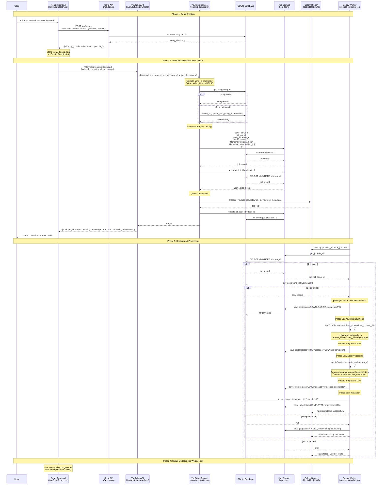

# YouTube Download Sequence Diagram

## Complete Flow: Frontend → Backend → Celery Worker

This diagram shows the exact sequence of events triggered by the YouTube download mutation in the Open Karaoke Studio project.

## Critical Points in the Flow

### 1. **Race Condition Prevention**
- Song is created FIRST via dedicated API endpoint
- YouTube download waits for song creation success
- Service layer verifies song exists before creating job

### 2. **Database Persistence Verification**
- Job is saved to database BEFORE queuing Celery task
- Service layer verifies job persistence with get_job() call
- Worker performs additional existence checks for both job and song

### 3. **Error Handling Points**
- **Frontend**: Song creation failure stops the flow
- **YouTube API**: Missing songId returns 400 error
- **Service Layer**: Song verification, job persistence verification
- **Worker**: Job not found, Song not found (fail fast, no retries)

### 4. **Current Architecture Benefits**
- Clear separation of concerns (song creation vs. processing)
- Robust error handling at each layer
- Database consistency before async processing
- Comprehensive logging for debugging

### 5. **Potential Issues Addressed**
- **Original Issue**: Job creation in API controller caused race conditions
- **Fix**: Moved job creation to service layer with verification
- **Database Transactions**: Ensure job persistence before queuing
- **Worker Validation**: Fail fast if prerequisites are missing

## Key Files in the Flow

1. **Frontend**: `frontend/src/components/upload/YouTubeSearch.tsx`
2. **Song API**: `backend/app/api/songs.py`
3. **YouTube API**: `backend/app/api/youtube.py`
4. **Service Layer**: `backend/app/services/youtube_service.py`
5. **Celery Job**: `backend/app/jobs/jobs.py` (`process_youtube_job`)
6. **Database**: `backend/app/db/database.py`
7. **Job Storage**: `backend/app/db/models/job.py`

## Debugging Tips

When investigating "Job not found" or "Song not found" errors:

1. Check if song was created successfully in Phase 1
2. Verify job was saved to database in Phase 2 (check logs for "Job {job_id} successfully saved")
3. Confirm Celery task was queued (check logs for "queued successfully with task {task_id}")
4. Check worker logs for job/song retrieval attempts
5. Verify database consistency between job creation and worker execution
