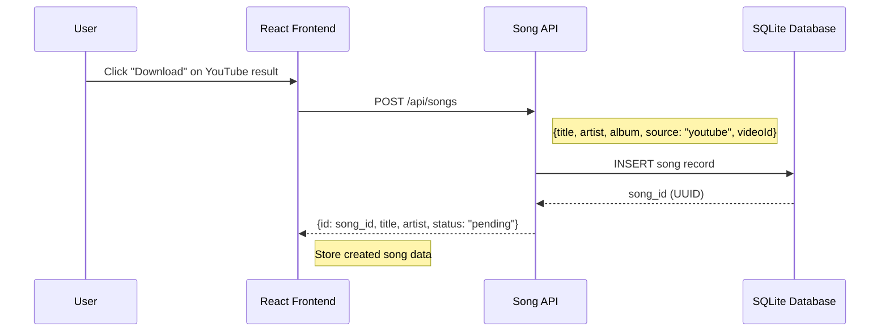
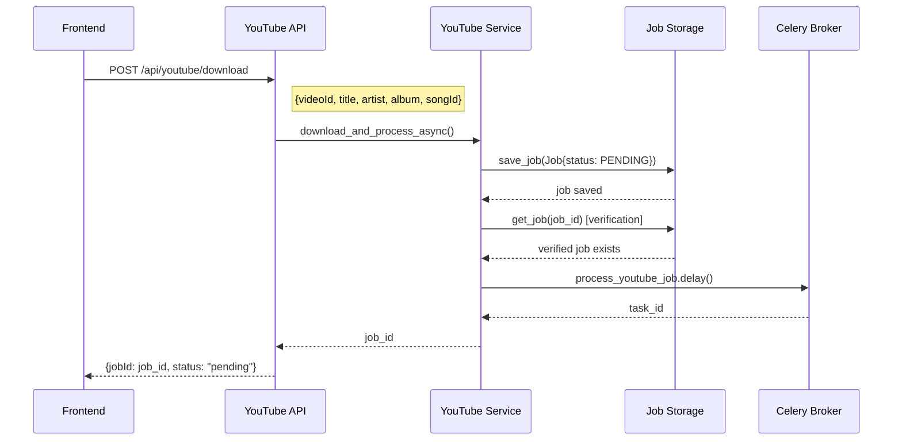
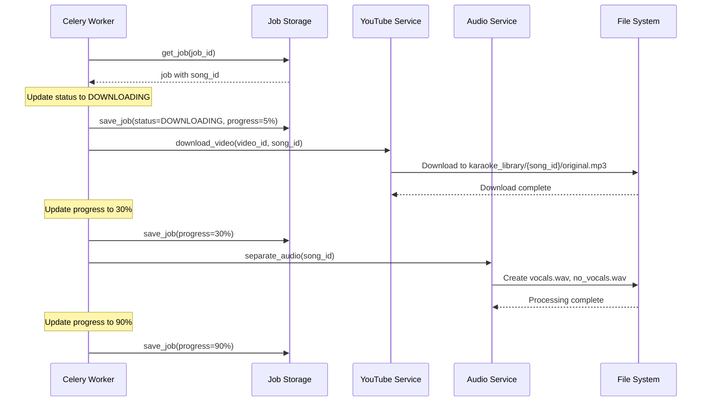
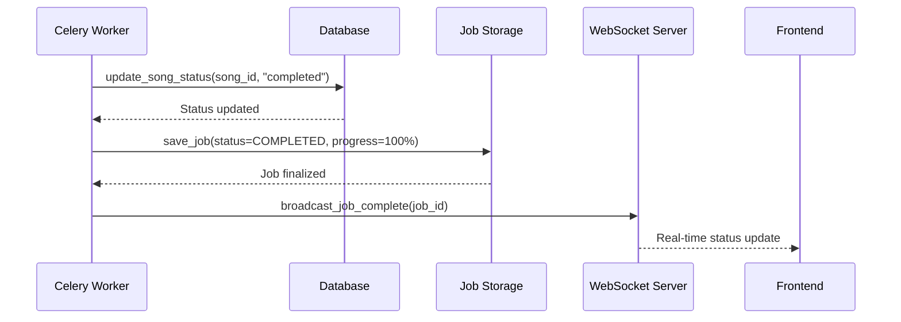

# YouTube Integration Workflow

The YouTube integration in Open Karaoke Studio provides a complete end-to-end workflow for converting YouTube videos into karaoke tracks. This document outlines the comprehensive flow from user interaction through background processing, highlighting the architecture that ensures reliability and proper error handling.

## Workflow Overview

The YouTube integration follows a multi-phase approach that separates immediate user feedback from long-running background processing:

1. **Song Creation Phase**: Immediate database record creation
2. **Job Queuing Phase**: Background processing setup
3. **Processing Phase**: Video download and audio separation
4. **Finalization Phase**: Status updates and completion

## Complete Flow Sequence

### Phase 1: Song Creation
*Immediate response to user interaction*



**Key Features**:
- **Immediate Response**: User gets instant feedback with song ID
- **Database Persistence**: Song record created before any processing
- **Status Tracking**: Initial status set to "pending" for UI updates

### Phase 2: YouTube Download Job Creation
*Background processing setup*



**Key Features**:
- **Job Persistence Verification**: Job saved to database before queuing
- **Race Condition Prevention**: Verification step ensures database consistency
- **Task Tracking**: Celery task ID linked to job for monitoring

### Phase 3: Background Processing
*Video download and audio separation*



**Key Features**:
- **Progress Tracking**: Real-time progress updates throughout processing
- **File Organization**: Structured file storage in song-specific directories
- **Service Coordination**: Clean separation between download and audio processing

### Phase 4: Finalization
*Status updates and completion*



**Key Features**:
- **Status Synchronization**: Both song and job status updated
- **Real-time Updates**: WebSocket notifications for immediate UI updates
- **Completion Verification**: Multiple confirmation points ensure reliability

## Architecture Benefits

### 1. Race Condition Prevention

The two-phase approach (song creation → job creation) eliminates race conditions:

```python
# Phase 1: Guaranteed song existence
song_id = create_song_via_api(metadata)

# Phase 2: Job creation with known song_id
job_id = youtube_service.download_and_process_async(
    video_id=video_id,
    song_id=song_id  # Guaranteed to exist
)
```

### 2. Database Consistency

Job persistence verification ensures reliable background processing:

```python
# Save job to database
job_store.save_job(job)

# Verify persistence before queuing
verification_job = job_store.get_job(job_id)
if not verification_job:
    raise ServiceError("Job persistence failed")

# Safe to queue for background processing
celery.process_youtube_job.delay(job_id)
```

### 3. Error Handling Points

Strategic error handling at each phase:

- **Phase 1**: Song creation failure stops entire flow
- **Phase 2**: Job creation/verification failure prevents queuing
- **Phase 3**: Worker validates job and song existence before processing
- **Phase 4**: Status update failures logged but don't break flow

### 4. Service Layer Coordination

Clean service interactions without tight coupling:

```python
class YouTubeService:
    def download_and_process_async(self, video_id: str, song_id: str) -> str:
        # Coordinate with multiple services
        job = self.jobs_service.create_youtube_job(song_id, video_id)
        task_id = self.celery_service.queue_processing_task(job.id)
        self.jobs_service.update_task_id(job.id, task_id)
        return job.id
```

## Error Recovery Strategies

### Network and Download Errors

```python
try:
    download_result = youtube_service.download_video(video_id, song_id)
except yt_dlp.DownloadError as e:
    job_store.save_job(job_id, status=FAILED, error=f"Download failed: {e}")
    raise ServiceError(f"YouTube download failed: {e}")
```

### File System Errors

```python
try:
    audio_service.separate_audio(song_id)
except FileNotFoundError as e:
    job_store.save_job(job_id, status=FAILED, error="Original file not found")
    raise ServiceError("Audio processing failed: original file missing")
```

### Database Consistency Errors

```python
def create_youtube_job(self, song_id: str, video_id: str) -> Job:
    # Verify song exists before creating job
    song = database.get_song(song_id)
    if not song:
        raise ValidationError(f"Song {song_id} not found")
    
    # Create job with verified song_id
    job = Job(song_id=song_id, video_id=video_id, status=PENDING)
    return job_store.save_job(job)
```

## Performance Optimizations

### Parallel Processing

- **Thumbnail Download**: Concurrent with video download
- **Metadata Extraction**: Performed during download, not after
- **Progress Updates**: Batched to reduce database load

### Resource Management

- **Memory Usage**: Streaming downloads to prevent memory exhaustion
- **Disk Space**: Cleanup of temporary files after processing
- **Network Usage**: Quality selection optimized for audio extraction

### Caching Strategy

- **Video Info Caching**: Recent video metadata cached to avoid re-extraction
- **Thumbnail Caching**: Downloaded thumbnails stored for reuse
- **Metadata Caching**: iTunes API responses cached for duplicate processing

## Monitoring and Debugging

### Logging Strategy

Each phase includes comprehensive logging:

```python
# Phase 1: Song Creation
logger.info(f"Creating song for YouTube video {video_id}")

# Phase 2: Job Creation  
logger.info(f"Job {job_id} successfully saved to database")
logger.info(f"Celery task queued with task_id {task_id}")

# Phase 3: Processing
logger.info(f"Starting YouTube download for job {job_id}")
logger.info(f"Download complete, starting audio processing")

# Phase 4: Completion
logger.info(f"YouTube processing complete for song {song_id}")
```

### Status Tracking

Multiple status tracking mechanisms:

- **Job Status**: PENDING → DOWNLOADING → PROCESSING → COMPLETED/FAILED
- **Song Status**: pending → processing → completed/error  
- **Progress Percentage**: 0% → 5% → 30% → 90% → 100%
- **WebSocket Events**: Real-time updates to frontend

### Debugging Tools

Common debugging scenarios:

1. **"Job not found" Errors**: Check job persistence verification logs
2. **"Song not found" Errors**: Verify Phase 1 completion before Phase 2
3. **Download Failures**: Check YouTube API rate limits and video availability
4. **Processing Failures**: Verify file system permissions and disk space

## Related Documentation

- **[YouTube Service](../services/youtube-service.md)** - Service implementation details
- **[Background Jobs](../background-jobs.md)** - Celery integration architecture
- **[File Service](../services/file-service.md)** - File organization patterns
- **[Audio Service](../services/audio-service.md)** - Audio processing coordination

---

**Implementation Status**: ✅ Production Ready  
**Key Files**: 
- Frontend: `frontend/src/components/upload/YouTubeSearch.tsx`
- APIs: `backend/app/api/songs.py`, `backend/app/api/youtube.py`  
- Services: `backend/app/services/youtube_service.py`
- Workers: `backend/app/jobs/jobs.py`
