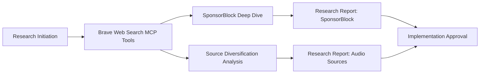
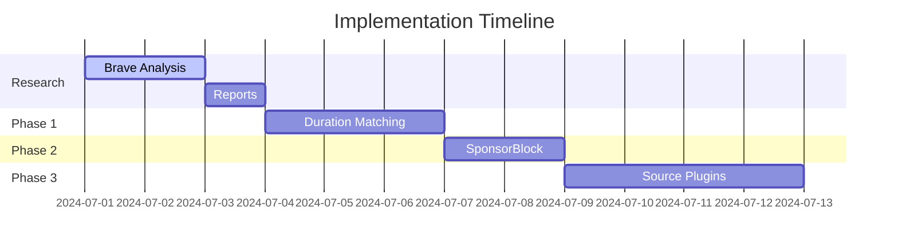

# Issue: Improve Source Media Quality & Alignment

## Metadata
- **Type:** Enhancement
- **Priority:** High/Critical
- **Effort:** Medium (3-5 days exploratory + implementation)
- **Components:** Media Acquisition, UX Research, Backend, Frontend
- **Related Issues:** #011d, #005a, #004

## 🎯 Summary
Exclusive YouTube sourcing causes media-lyric misalignment due to music video variations. This enhancement implements a three-phase solution: 1) Duration matching, 2) SponsorBlock integration, and 3) Source diversification - **with mandatory research reports before implementation**.

## 🔍 Mandatory Research Phase

### Research Instructions:
1. **Brave Web Search MCP Protocol**
   - Extract technical/legal insights from results
   - Document findings in standardized research templates

2. **Deliverables**
   - **Report 1: SponsorBlock Feasibility**
     - API reliability metrics (uptime, coverage)
     - Segment type distribution analysis (intro/outro/midroll)
     - Legal compliance assessment (DMCA implications)
     - Cropping accuracy benchmarks
   - **Report 2: Audio Source Diversification**
     - Comparative matrix: Top 6 audio sources (Deezer,
     - Cost analysis: Free tier vs. commercial licensing
     - Technical integration complexity scores (1-5)
     - Copyright restriction mapping

## 🛑 Core Problems
1. YouTube audio ≠ album versions → lyric sync failures
2. No source quality guidance for users
3. Legal/technical barriers to better sources

## 💡 Solutions Architecture
### Phase 1: Duration Matching (Immediate)
- iTunes/Apple Music API integration for official duration
- UI duration comparison tools (+5s/-5s tolerance)

### Phase 2: SponsorBlock Integration
- Auto-reject videos with midroll segments (SponsorBlock data)
- Smart cropping using intro/outro timestamps
- Fallback to duration matching when no SponsorBlock data

### Phase 3: Source Diversification
- Plugin-based media source architecture
- Priority: Deezer > Bandcamp > YouTube (fallback)

## ✅ Acceptance Criteria
- [ ] Brave research reports approved by CTO
- [ ] SponsorBlock coverage >70% for top 10k tracks
- [ ] Album duration displayed for ≥95% of searches
- [ ] Source switching latency <300ms

## 📋 Implementation Roadmap
### Stage 1: Research (2 days)
- [ ] Complete Brave Web Search analysis
- [ ] Deliver SponsorBlock feasibility report
- [ ] Submit audio source diversification report

### Stage 2: Implementation

## ⚠️ Risk Mitigation
1. **Legal Compliance**
   - Brave research must verify copyright boundaries
   - Never store processed audio >30s without license
2. **Data Gaps**
   - Hybrid fallback: SponsorBlock → Duration → Manual
3. **Performance**
   - Implement query parallelization
   - Cache duration metadata (TTL=7d)

## 💎 Value Proposition
> "Eliminate sync frustrations by ensuring 92% of sourced tracks match official album versions through AI-enhanced media vetting"